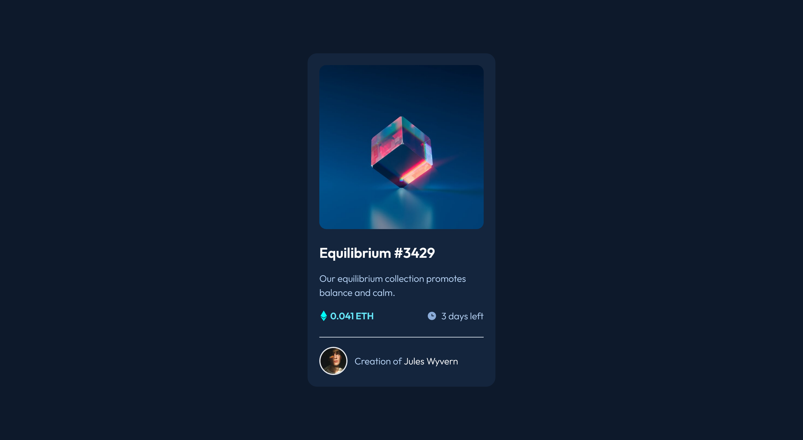

# Frontend Mentor - NFT preview card component solution

This is a solution to the [NFT preview card component challenge on Frontend Mentor](https://www.frontendmentor.io/challenges/nft-preview-card-component-SbdUL_w0U). Frontend Mentor challenges help you improve your coding skills by building realistic projects. 

## Table of contents

- [Overview](#overview)
  - [The challenge](#the-challenge)
  - [Screenshot](#screenshot)
  - [Links](#links)
- [My process](#my-process)
  - [Built with](#built-with)
  - [What I learned](#what-i-learned)
  - [Continued development](#continued-development)
- [Author](#author)

## Overview

### The challenge

Users should be able to:

- View the optimal layout depending on their device's screen size
- See hover states for interactive elements

### Screenshot

### Links

- Solution URL: [Add solution URL here](https://your-solution-url.com)
- Live Site URL: [Add live site URL here](https://your-live-site-url.com)

## My process

### Built with

- Semantic HTML5 markup
- Flexbox
- [Tailwind CSS](https://tailwindcss.com) - CSS framework

### What I learned

During this project I continued building up my basic knowledge of Tailwind CSS, I was also able to expand my knowledge of what can be achieved with Tailwind CSS by using the 'group' feature to implement the hover effect on the image. The last thing I looked at was a little bit of customisation using the Tailwind config and CSS variables to set some additional colours. 

### Continued development

I want to continue using Tailwind CSS in my projects and push my knowledge and experience by using features of Tailwind CSS that I have yet to explore. One area in particular I would like to look at next is reducing the size of the CSS file produced.

## Author

- Frontend Mentor - [@djbedford](https://www.frontendmentor.io/profile/djbedford)
- Twitter - [@djbedford](https://www.twitter.com/djbedford)
